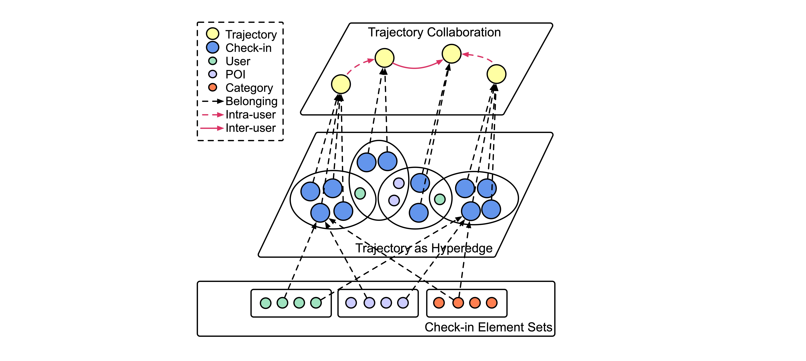
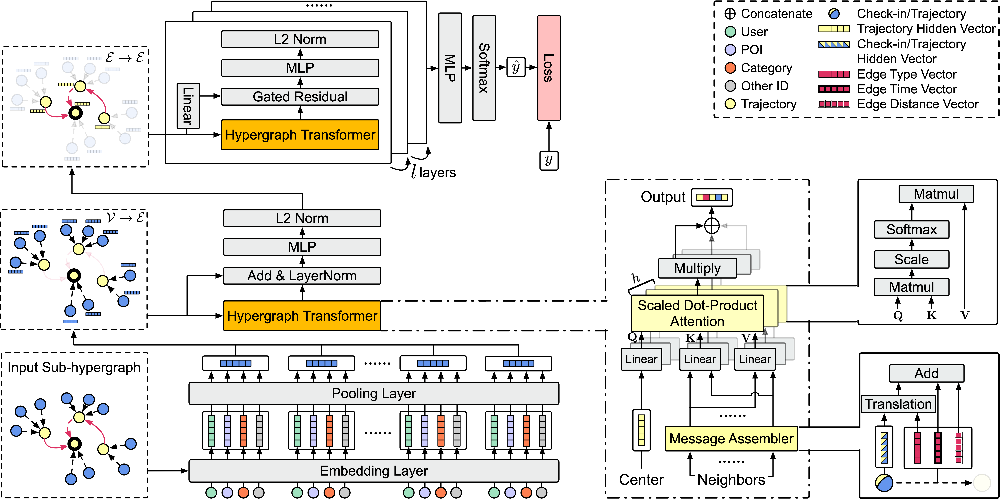

# STHGCN
This repository includes the implementation details of the method STHGCN and helps readers to reproduce the results in the paper
**Spatio-Temporal Hypergraph Learning for Next POI Recommendation**, whose objective is to utilize hypergraph convolution networks to 
model diverse user behaviors in the next-POI recommendation task. 

In particular, we introduce a hypergraph to construct the complex
structure of check-ins and trajectories. We develop hypergraph transformer layers to capture high-order heterogeneous inter-user
and intra-user trajectories correlations while incorporating spatio-temporal contexts. 
Comprehensive experiments conducted on three real-world datasets have demonstrated the superiority of STHGCN in the task of next-POI recommendation,
outperforming baseline models by a large margin. For more information, please see our paper **Spatio-Temporal Hypergraph Learning for Next POI Recommendation** (Yan *et al. 2023*).

+ Multi-Level Hypergraph


+ Model Framework


## Installation
1. Clone the repository (If showing error of no permission, need to first [add a new SSH key to your GitHub account](https://docs.github.com/en/authentication/connecting-to-github-with-ssh/adding-a-new-ssh-key-to-your-github-account).):
    ```shell
   git clone https://github.com/ant-research/Spatio-Temporal-Hypergraph-Model.git
    ```
2. The repository has some important dependencies below, and we don't guarantee that the code still works if using higher versions. 
   Please refer to the respective page to install:
   + [Pytorch](https://pytorch.org/) == 1.7.0
   + [pytorch_geometric](https://github.com/pyg-team/pytorch_geometric#installation) == 1.7.2
     + torch-scatter == 2.0.7
     + torch-sparse == 0.6.9
     + torch-cluster == 1.5.9
     + torch-spline-conv == 1.2.1
3. Install other dependencies in `requirements.txt`:
    ```shell
    pip install -r requirements.txt
    ```

## Hardware
Here are the minimum requirements of the hardware including CPU and GPU.

+ CPU: core 16, memory 30GB
+ GPU: Tesla V100 (16GB)

Important messages you need to know:
1. For Foursquare-TKY dataset, if the first value of hyperparameter sizes is more than 300 such as "400-240", please use 32GB GPU; 
2. If you use other type of GPU like Tesla P100, it may produce different results even if you use the best configuration file with the same random seed.

## Dataset
The Foursquare-NYC dataset is collected in New York city and the Foursquare-TKY dataset is collected in Tokyo over 11 months 
(from April 2012 to February 2013) from Foursquare. The Gowalla-CA dataset with a longer time period (from March 2009 to October 2010) and
broader geographical coverage are collected in California and Nevada on the Gowalla platform.

### Preprocess
The preprocess step includes creating train/validate/test sample files and generating hypergraph-related PyG data files.
The preprocess step will be excuted the first time we train our model using `run.py`, this step will be skipped if we
already preprocess the same data before.

To get the raw data:
+ Unzip `data/nyc/raw.zip` to `data/nyc`. Then you will get `raw` directory with three .csv files, including trainginng sample file `NYC_train.csv`, 
validating sample file `NYC_val.csv` and testing sample file `NYC_test.csv`.
+ Unzip `data/tky/raw.zip` to `data/tky`. Then you will get `raw` directory with file `dataset_TSMC2014_TKY.txt` containing 
all the checkin information.
+ Unzip `data/ca/raw.zip` to `data/ca`. Then you will get `raw` directory with file `loc-gowalla_totalCheckins.txt` containing raw checkin records,
 `gowalla_spots_subset1.csv` containing category-involved checkin records, and `us_state_polygon_json.json` containing the POI 
polygon of every state in U.S. To get the raw data of CA used for preprocessing including the correct category information, run
    ```shell
    python generate_ca_raw.py
    ```

If you want to compare your model with our work in the same preprocess setting, 
we strongly suggest to directly use the `sample.csv`, `train_sample.csv`, `validate_sample.csv`, and `test_sample.csv` 
sample files in the preprocessed directories.

### Statistical Information
After preprocessing (some works only show the statistics before preprocessing), the key statistics of the three dtasets are shown below.
The first 6 columns are calculated based on `sample.csv` which is all the samples before removing the unseen user or poi. Meanwhile, the last
3 columns are calculated based on `train_sample.csv`, `validate_sample.csv` and `test_sample.csv`.

| Dataset Name   | #user | #poi    | #category | #check-in | #trajectory | #training sample| #validation sample| #testing sample|
|----------------|-------|---------|-----------|-----------|-------------|-----------------|-------------------|----------------|
| Foursquare-NYC | 1,048 | 4,981   | 318       | 103,941   | 14,130      | 72,206          | 1,400             | 1,347          |
| Foursquare-TKY | 2,282 | 7,833   | 290       | 405,000   | 65,499      | 274,597         | 6,868             | 7,038          |
| Gowalla-CA     | 3,957 | 9,690   | 296       | 238,369   | 45,123      | 154,253         | 3,529             | 2,780          |

### Original Link
In case of some readers feel confused from the data provided by our work and by other works, here we introduce where and how our data comes from.

Actually, we suffered a lot from searching for the valid data from previous works. [STAN](https://github.com/yingtaoluo/Spatial-Temporal-Attention-Network-for-POI-Recommendation)
provides the **Raw** data of NYC, TKY and CA, but these data lack category information. [GETNext](https://github.com/songyangme/GETNext) only
provides the **Preprocessed** data of NYC, while TKY and CA are missing. We use the raw NYC data from STAN's link, and preprocess them based on the 
description from GETNext. Unfortunately, there still be a minor gap between our preprocessed NYC data with what is provided by GETNext. 

For fair comparison of different models, for NYC, we download the preprocessed files from GETNext; For TKY and CA, we download them from the link provided 
by STAN, we also fetch the category information from [IRenMF](https://dl.acm.org/doi/10.1145/2661829.2662002). We run GETNext model with our preprocessed data and
the performances are only a little worse (~0.01 on Acc@1) than what are reported in thier paper, so we just use the performances reported in their paper.

Thanks for all the data providers.

+ NYC: 
  + Preprocessed: https://github.com/songyangme/GETNext/blob/master/dataset/NYC.zip
+ TKY: 
  + Raw: http://www-public.imtbs-tsp.eu/~zhang_da/pub/dataset_tsmc2014.zip
+ CA: 
  + Raw: http://snap.stanford.edu/data/loc-gowalla.html; 
  + Category information: https://www.yongliu.org/datasets.html

## Main Experimental Results
To reproduce the main results in our paper. Please follow the steps below.

### Main Performance
To know the meaning of every config in yaml file, please refer to [conf/README.md](https://github.com/ant-research/Spatio-Temporal-Hypergraph-Model/blob/main/conf/README.md).

We can reproduce the best performance of our model with the script below. Please choose 'nyc', 'tky', 
or 'ca' for *{dataset_name}*.
```shell
python run.py -f best_conf/{dataset_name}.yml
```

| Dataset Name | Acc@1  | Acc@5  | Acc@10 | MRR    | #Parameters | Training Speed<br>(per epoch)|
|--------------|--------|--------|--------|--------|-------------|------------------------------|
| NYC          | 0.2734 | 0.5361 | 0.6244 | 0.3915 | 27,820,020  | 3m24s                        | 
| TKY          | 0.2950 | 0.5207 | 0.5980 | 0.3986 | 30,167,576  | 59m31s                       |
| CA           | 0.1730 | 0.3529 | 0.4191 | 0.2558 | 31,810,778  | 15m40s                       |

The average performances of 10 runs can be achived using the script below. `-n` denotes the total number of experiments. `-g` 
denotes the gpu id (default 0).
```shell
python multiple_run.py -f best_conf/{dataset_name}.yml -n 10 -g 0
```

| Dataset Name | Acc@1           | Acc@5           | Acc@10          | MRR             |
|--------------|-----------------|-----------------|-----------------|-----------------|
| NYC          | 0.2625 ± 0.0054 | 0.5226 ± 0.0033 | 0.6117 ± 0.0044 | 0.3798 ± 0.0041 |
| TKY          | 0.2905 ± 0.0035 | 0.5184 ± 0.0035 | 0.5969 ± 0.0030 | 0.3951 ± 0.0025 |
| CA           | 0.1652 ± 0.0036 | 0.3405 ± 0.0041 | 0.4177 ± 0.0038 | 0.2491 ± 0.0026 |

### Ablation Study
Based on the configuration for best model in `conf/best_conf/`, we only modify some key configs to do ablation study.

+ For *w/o Hypergraph*, we set `model_name: seq_transformer`. It's worth to mension that we use the same NeighborSampler and 
  transform the adjacency list into sequential input for Transformer model. So the inputs are the same with vanilla Transformer. Please run
```shell
python multiple_run.py -f ablation_conf/{dataset_name}_wo_hypergraph.yml -n 10 -g 0
```
+ For *w/o ST Information*, we set `time_fusion_mode: `. Please run
```shell
python multiple_run.py -f ablation_conf/{dataset_name}_wo_st_info.yml -n 10 -g 0
```
+ For *w/o Hyperedge Collaboration*, we set `do_traj2traj: False`
```shell
python multiple_run.py -f ablation_conf/{dataset_name}_wo_hyper_collab.yml -n 10 -g 0
```

The ablation results are list below, which are consistent though slightly different with Table 4 in our paper:

+ NYC:

|                             | Acc@1           | Acc@5           | Acc@10          | MRR             |
|-----------------------------|-----------------|-----------------|-----------------|-----------------|
| Full Model                  | 0.2625 ± 0.0054 | 0.5226 ± 0.0033 | 0.6117 ± 0.0044 | 0.3798 ± 0.0041 |
| w/o Hypergraph              | 0.2391 ± 0.0068 | 0.5137 ± 0.0094 | 0.6069 ± 0.0091 | 0.3618 ± 0.0050 |
| w/o ST Information          | 0.2332 ± 0.0048 | 0.5113 ± 0.0039 | 0.6091 ± 0.0069 | 0.3591 ± 0.0034 |
| w/o Hyperedge Collaboration | 0.2490 ± 0.0058 | 0.5048 ± 0.0098 | 0.5885 ± 0.0052 | 0.3641 ± 0.0055 |

+ TKY:

|                             | Acc@1           | Acc@5           | Acc@10          | MRR             |
|-----------------------------|-----------------|-----------------|-----------------|-----------------|
| Full Model                  | 0.2905 ± 0.0035 | 0.5184 ± 0.0035 | 0.5969 ± 0.0030 | 0.3951 ± 0.0025 |
| w/o Hypergraph              | 0.2368 ± 0.0018 | 0.4453 ± 0.0016 | 0.5222 ± 0.0015 | 0.3337 ± 0.0014 |
| w/o ST Information          | 0.2629 ± 0.0051 | 0.4941 ± 0.0039 | 0.5770 ± 0.0030 | 0.3689 ± 0.0037 |
| w/o Hyperedge Collaboration | 0.2455 ± 0.0027 | 0.4589 ± 0.0031 | 0.5361 ± 0.0026 | 0.3446 ± 0.0018 |

+ CA:

|                             | Acc@1           | Acc@5           | Acc@10          | MRR             |
|-----------------------------|-----------------|-----------------|-----------------|-----------------|
| Full Model                  | 0.1652 ± 0.0036 | 0.3405 ± 0.0041 | 0.4177 ± 0.0038 | 0.2491 ± 0.0026 |
| w/o Hypergraph              | 0.1476 ± 0.0031 | 0.3146 ± 0.0024 | 0.3859 ± 0.0051 | 0.2270 ± 0.0028 |
| w/o ST Information          | 0.1578 ± 0.0042 | 0.3242 ± 0.0037 | 0.4021 ± 0.0054 | 0.2384 ± 0.0032 |
| w/o Hyperedge Collaboration | 0.1538 ± 0.0028 | 0.3227 ± 0.0046 | 0.3917 ± 0.0045 | 0.2341 ± 0.0028 |

## Tensorboard
All the measurements and visualizations can be displayed via tensorboard tool. The tensorboard files are 
in `tensorboard` directory.

```shell
tensorboard --logdir {tensorboard_directory}
```

 If you want to analysis the experimental results such as measuring the mean and 
standard deviation of 10 runs of the same hyper-parameter setting, you can just download the **TABLE VIEW** data as csv files
under **HPARAMS** tab.

## Citation
If you compare with, build on, or use aspects of the STHGCN, please cite the following:

```text
  @inproceedings{sigir2023sthgcn,
  title={Spatio-Temporal Hypergraph Learning for Next POI Recommendation},
  author={Yan, Xiaodong, and Song, Tengwei and Jiao, Yifeng and He, Jianshan and Wang, Jiaotuan and Li, Ruopeng and Chu, Wei},
  booktitle={Proceedings of the 46th International ACM SIGIR Conference on Research and Development in Information Retrieval},
  year={2023},
  series={SIGIR '23}
  }
```
